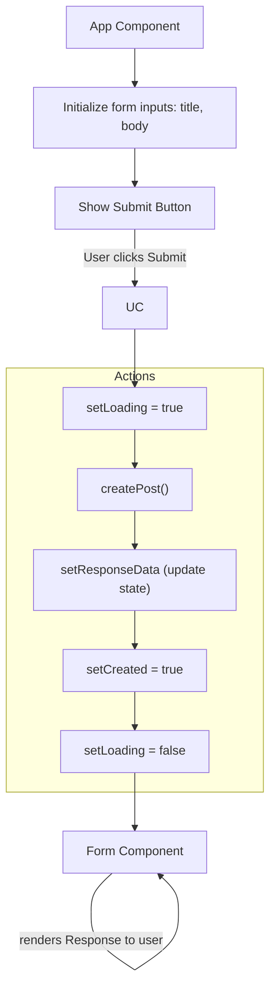
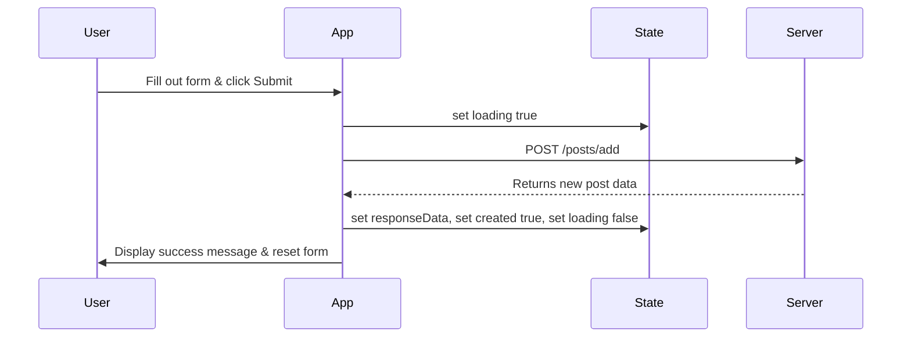

# #React Study Doc - #POST Request

### #Mermaid Flowchart



### [useEffect](https://react.dev/reference/react/useEffect) for POST Requests

Unlike fetching data on **mount** with GET requests, you typically **don’t** make POST requests inside `useEffect`.
POST requests are usually **triggered by user actions**, such as clicking a button or submitting a form.

If you want to **react to a successful POST** (e.g., updating the UI or refetching data), you *can* use `useEffect`:

```jsx
useEffect(() => {
  if (created) {
    console.log("Post successfully created!");
  }
}, [created]);
```

#### My Code — Making a POST Request

```jsx
import React, { useState } from "react";

function App() {
  const [newPost, setNewPost] = useState({ title: "", body: "" });
  const [responseData, setResponseData] = useState(null);
  const [loading, setLoading] = useState(false);
  const [error, setError] = useState("");
  const [created, setCreated] = useState(false);

  async function createPost() {
    setLoading(true);
    setError("");
    setCreated(false);

    try {
      const res = await fetch("https://dummyjson.com/posts/add", {
        method: "POST",
        headers: {
          "Content-Type": "application/json",
        },
        body: JSON.stringify({
          title: newPost.title,
          body: newPost.body,
          userId: 1,
        }),
      });

      if (!res.ok) throw new Error("Failed to create post");

      const data = await res.json();
      setResponseData(data);
      setCreated(true);
      setNewPost({ title: "", body: "" }); // Reset form on success
    } catch (err) {
      setError(err.message);
    } finally {
      setLoading(false);
    }
  }

  return (
    <div style={{ padding: "1.5em" }}>
      <h2>Create a New Post</h2>
      <input
        type="text"
        placeholder="Title"
        value={newPost.title}
        onChange={(e) => setNewPost({ ...newPost, title: e.target.value })}
      />
      <br />
      <textarea
        placeholder="Body"
        value={newPost.body}
        onChange={(e) => setNewPost({ ...newPost, body: e.target.value })}
      />
      <br />
      <button onClick={createPost} disabled={loading}>
        {loading ? "Submitting..." : "Submit"}
      </button>

      {error && <p style={{ color: "red" }}>{error}</p>}
      {created && responseData && (
        <div style={{ marginTop: "1em" }}>
          <h3>Post Created Successfully!</h3>
          <p>
            <strong>ID:</strong> {responseData.id}
          </p>
          <p>
            <strong>Title:</strong> {responseData.title}
          </p>
          <p>
            <strong>Body:</strong> {responseData.body}
          </p>
        </div>
      )}
    </div>
  );
}

export default App;
```

### Handling Rendering States

There are **3 UI states** to manage:

1. **`loading`** → Form submission in progress
2. **`error`** → Request failed
3. **`created`** → Successfully created post

```tsx
function Spinner() {
  return <div style={{ padding: "2em", textAlign: "center" }}>Submitting...</div>;
}

function ErrorMessage({ message }) {
  return (
    <div>
      <p style={{ color: "red", padding: "2em" }}>{message}</p>
    </div>
  );
}

// Example usage inside your component's JSX:
<section>
  {loading ? (
    <Spinner />
  ) : error ? (
    <ErrorMessage message={error} />
  ) : created ? (
    <div>✅ Post successfully created!</div>
  ) : null}
</section>
```

### #Mermaid Sequence Diagram


