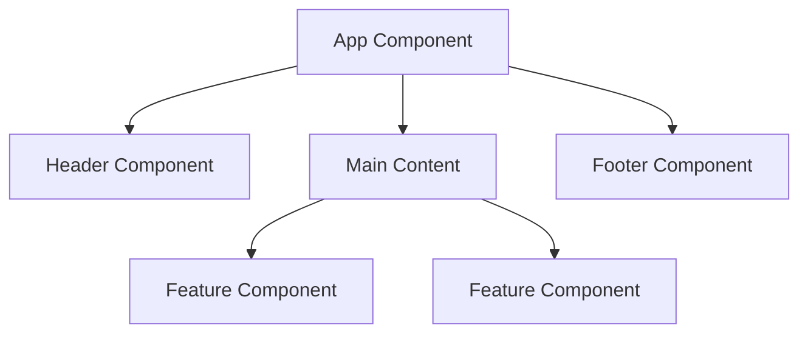

# React Fundamentals

React is a JavaScript library for building user interfaces. It's component-based, declarative, and efficient.

## Key Concepts

- **Components**: Reusable UI pieces that can be composed together
- **Props**: Data passed down from parent to child components
- **State**: Internal data that can change over time
- **JSX**: Syntax extension that looks like HTML but is JavaScript

## Component Structure

```jsx
function Welcome(props) {
  return <h1>Hello, {props.name}!</h1>;
}
```

## Mermaid Component Diagram



## Learning Path

1. **Start with Components** - Learn the building blocks
2. **Master State & Props** - Understand data flow
3. **Explore Hooks** - Modern React patterns
4. **Practice Data Fetching** - Real-world scenarios
5. **Build Complex UIs** - Advanced patterns

## Why React?

- **Declarative**: Describe what you want, not how to do it
- **Component-Based**: Reusable, maintainable code
- **Virtual DOM**: Efficient updates and rendering
- **Rich Ecosystem**: Huge community and libraries
- **Learn Once, Write Anywhere**: Web, mobile, desktop

## Component Types

### Functional Components

```jsx
function Greeting({ name }) {
  return <h1>Hello, {name}!</h1>;
}
```

### Class Components

```jsx
class Greeting extends React.Component {
  render() {
    return <h1>Hello, {this.props.name}!</h1>;
  }
}
```

### Arrow Function Components

```jsx
const Greeting = ({ name }) => {
  return <h1>Hello, {name}!</h1>;
};
```

## Props and State

### Props (Read-only)

```jsx
function UserCard({ user, onEdit }) {
  return (
    <div>
      <h2>{user.name}</h2>
      <p>{user.email}</p>
      <button onClick={() => onEdit(user.id)}>Edit</button>
    </div>
  );
}
```

### State (Mutable)

```jsx
function Counter() {
  const [count, setCount] = useState(0);

  return (
    <div>
      <p>Count: {count}</p>
      <button onClick={() => setCount(count + 1)}>Increment</button>
    </div>
  );
}
```

## JSX Rules

1. **Must return a single element** (or Fragment)
2. **Use camelCase** for attributes
3. **Use className** instead of class
4. **JavaScript expressions** go in curly braces `{}`
5. **Close all tags** (including self-closing)

```jsx
function Example() {
  const name = 'React';
  const isActive = true;

  return (
    <div className="container">
      <h1>Welcome to {name}</h1>
      <button disabled={!isActive}>{isActive ? 'Click me' : 'Disabled'}</button>
    </div>
  );
}
```

## Event Handling

```jsx
function Form() {
  const [input, setInput] = useState('');

  const handleSubmit = (e) => {
    e.preventDefault();
    console.log('Form submitted:', input);
  };

  const handleChange = (e) => {
    setInput(e.target.value);
  };

  return (
    <form onSubmit={handleSubmit}>
      <input value={input} onChange={handleChange} placeholder="Type something..." />
      <button type="submit">Submit</button>
    </form>
  );
}
```

## Conditional Rendering

```jsx
function Greeting({ user }) {
  if (!user) {
    return <div>Please log in</div>;
  }

  return (
    <div>
      <h1>Welcome back, {user.name}!</h1>
      {user.isAdmin && <AdminPanel />}
    </div>
  );
}
```

## Lists and Keys

```jsx
function TodoList({ todos }) {
  return (
    <ul>
      {todos.map((todo) => (
        <li key={todo.id}>{todo.text}</li>
      ))}
    </ul>
  );
}
```

## Component Composition

```jsx
function App() {
  return (
    <div>
      <Header />
      <Main>
        <Sidebar />
        <Content />
      </Main>
      <Footer />
    </div>
  );
}
```
