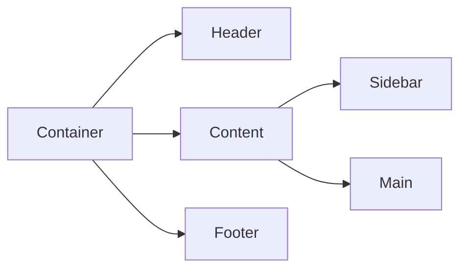

# Advanced React Patterns

## Custom Hooks

Custom hooks allow you to extract component logic into reusable functions.

```jsx
function useCounter(initialValue = 0) {
  const [count, setCount] = useState(initialValue);

  const increment = () => setCount(count + 1);
  const decrement = () => setCount(count - 1);
  const reset = () => setCount(initialValue);

  return { count, increment, decrement, reset };
}
```

## Performance Optimization

- **React.memo**: Prevents unnecessary re-renders
- **useMemo**: Memoizes expensive calculations
- **useCallback**: Memoizes function references

## Component Composition



## Advanced Patterns

### Render Props

```jsx
function DataFetcher({ render }) {
  const [data, setData] = useState(null);

  useEffect(() => {
    fetchData().then(setData);
  }, []);

  return render(data);
}

// Usage
<DataFetcher render={(data) => <UserList users={data} />} />;
```

### Higher-Order Components

```jsx
function withLoading(Component) {
  return function WrappedComponent(props) {
    const [loading, setLoading] = useState(true);

    useEffect(() => {
      // Simulate loading
      setTimeout(() => setLoading(false), 1000);
    }, []);

    if (loading) return <div>Loading...</div>;
    return <Component {...props} />;
  };
}

const UserListWithLoading = withLoading(UserList);
```

### Compound Components

```jsx
function Tabs({ children }) {
  const [activeTab, setActiveTab] = useState(0);

  return (
    <TabsContext.Provider value={{ activeTab, setActiveTab }}>{children}</TabsContext.Provider>
  );
}

Tabs.List = function TabsList({ children }) {
  return <div className="tabs-list">{children}</div>;
};

Tabs.Tab = function Tab({ children, index }) {
  const { activeTab, setActiveTab } = useContext(TabsContext);

  return (
    <button className={activeTab === index ? 'active' : ''} onClick={() => setActiveTab(index)}>
      {children}
    </button>
  );
};

Tabs.Panel = function TabPanel({ children, index }) {
  const { activeTab } = useContext(TabsContext);

  if (activeTab !== index) return null;
  return <div className="tab-panel">{children}</div>;
};

// Usage
<Tabs>
  <Tabs.List>
    <Tabs.Tab index={0}>Tab 1</Tabs.Tab>
    <Tabs.Tab index={1}>Tab 2</Tabs.Tab>
  </Tabs.List>
  <Tabs.Panel index={0}>Content 1</Tabs.Panel>
  <Tabs.Panel index={1}>Content 2</Tabs.Panel>
</Tabs>;
```

## Context API

```jsx
const ThemeContext = createContext();

function ThemeProvider({ children }) {
  const [theme, setTheme] = useState('light');

  const toggleTheme = () => {
    setTheme((prev) => (prev === 'light' ? 'dark' : 'light'));
  };

  return <ThemeContext.Provider value={{ theme, toggleTheme }}>{children}</ThemeContext.Provider>;
}

function useTheme() {
  const context = useContext(ThemeContext);
  if (!context) {
    throw new Error('useTheme must be used within ThemeProvider');
  }
  return context;
}
```

## Error Boundaries

```jsx
class ErrorBoundary extends React.Component {
  constructor(props) {
    super(props);
    this.state = { hasError: false, error: null };
  }

  static getDerivedStateFromError(error) {
    return { hasError: true, error };
  }

  componentDidCatch(error, errorInfo) {
    console.error('Error caught by boundary:', error, errorInfo);
  }

  render() {
    if (this.state.hasError) {
      return (
        <div className="error-boundary">
          <h2>Something went wrong</h2>
          <details>
            <summary>Error details</summary>
            <pre>{this.state.error?.toString()}</pre>
          </details>
        </div>
      );
    }

    return this.props.children;
  }
}
```

## Testing React Components

```jsx
import { render, screen } from '@testing-library/react';
import userEvent from '@testing-library/user-event';

test('counter increments when button is clicked', () => {
  render(<Counter />);

  const button = screen.getByRole('button');
  userEvent.click(button);

  expect(screen.getByText('Count: 1')).toBeInTheDocument();
});

test('renders user name', () => {
  const user = { name: 'John Doe' };
  render(<UserProfile user={user} />);

  expect(screen.getByText('John Doe')).toBeInTheDocument();
});
```

## React DevTools

### Profiler

```jsx
import { Profiler } from 'react';

function onRenderCallback(id, phase, actualDuration, baseDuration, startTime, commitTime) {
  console.log(`Component ${id} took ${actualDuration}ms to render`);
}

<Profiler id="App" onRender={onRenderCallback}>
  <App />
</Profiler>;
```

### Strict Mode

```jsx
import { StrictMode } from 'react';

<StrictMode>
  <App />
</StrictMode>;
```

## Best Practices

1. **Keep components small and focused**
2. **Use TypeScript for better type safety**
3. **Implement proper error boundaries**
4. **Optimize for performance early**
5. **Write comprehensive tests**
6. **Follow consistent naming conventions**

## Code Splitting

### Dynamic Imports

```jsx
import { lazy, Suspense } from 'react';

const LazyComponent = lazy(() => import('./LazyComponent'));

function App() {
  return (
    <Suspense fallback={<div>Loading...</div>}>
      <LazyComponent />
    </Suspense>
  );
}
```

### Route-based Splitting

```jsx
import { lazy } from 'react';
import { Routes, Route } from 'react-router-dom';

const Home = lazy(() => import('./pages/Home'));
const About = lazy(() => import('./pages/About'));
const Contact = lazy(() => import('./pages/Contact'));

function App() {
  return (
    <Suspense fallback={<div>Loading...</div>}>
      <Routes>
        <Route path="/" element={<Home />} />
        <Route path="/about" element={<About />} />
        <Route path="/contact" element={<Contact />} />
      </Routes>
    </Suspense>
  );
}
```

## Performance Monitoring

### React Profiler

```jsx
import { Profiler } from 'react';

function onRenderCallback(id, phase, actualDuration, baseDuration, startTime, commitTime) {
  // Log performance metrics
  console.log({
    id,
    phase,
    actualDuration,
    baseDuration,
    startTime,
    commitTime,
  });
}

<Profiler id="App" onRender={onRenderCallback}>
  <App />
</Profiler>;
```

### Bundle Analysis

```bash
# Analyze bundle size
npm install --save-dev webpack-bundle-analyzer

# Add to webpack config
const BundleAnalyzerPlugin = require('webpack-bundle-analyzer').BundleAnalyzerPlugin;

module.exports = {
  plugins: [
    new BundleAnalyzerPlugin()
  ]
};
```

## Accessibility

### ARIA Labels

```jsx
function SearchInput({ onSearch }) {
  return (
    <div>
      <label htmlFor="search">Search:</label>
      <input
        id="search"
        type="text"
        aria-describedby="search-help"
        placeholder="Enter search terms..."
      />
      <div id="search-help">Type keywords to find relevant content</div>
    </div>
  );
}
```

### Keyboard Navigation

```jsx
function MenuItem({ children, onSelect }) {
  const handleKeyDown = (e) => {
    if (e.key === 'Enter' || e.key === ' ') {
      e.preventDefault();
      onSelect();
    }
  };

  return (
    <div role="menuitem" tabIndex={0} onKeyDown={handleKeyDown} onClick={onSelect}>
      {children}
    </div>
  );
}
```
