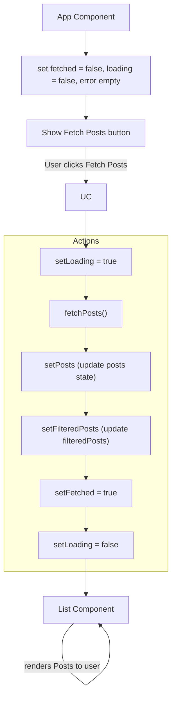
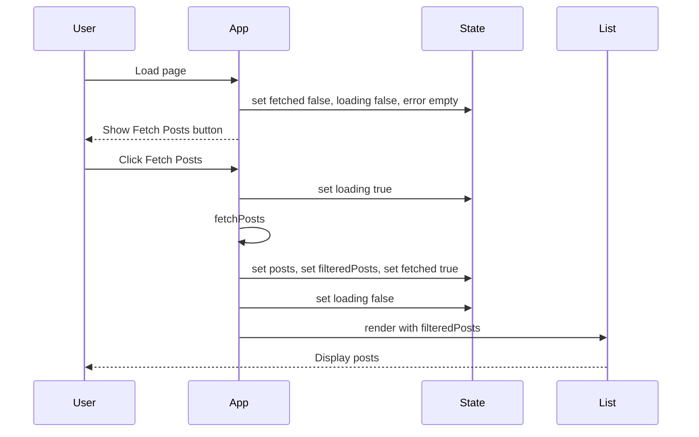

# React Study Doc - Fetching Data

### Mermaid Flowchart



### useEffect

`useEffect` is a React Hook that lets you run _side effects_ in your function components.

**Side effects** include:

- data fetching
- subscriptions
- manually changing the DOM
- timers
- etc.

```tsx
useEffect(setup, dependencies?)
```

#### Parameters

##### setup function

The _first argument_ is a `function`.

This function runs _after the component renders_.

> This function has your Effect's _logic_.

Your setup function may also optionally return a _cleanup_ function.

> When your component is added to the DOM, React will run your setup function. After every re-render with changed dependencies, React will first run the cleanup function (if you provided it) with the old values, and then run your setup function with the new values.

After your component is removed from the DOM, React will run your cleanup function.

##### dependencies

The _second argument_ is an `array of variables`.

The **effect will re-run** _whenever any value in this array changes_.

If you pass an **empty array** ( `[]`), _the effect runs only once after the initial render_ (like `componentDidMount`).

If you **omit the array**, the effect will _run after every render_.

> If your linter is configured for React, it will verify that every reactive value is correctly specified as a dependency.

The **list of dependencies** must have a _constant number of items_ and be written inline like [dep1, dep2, dep3].

> React will compare each dependency with its previous value using the Object.is comparison. If you omit this argument, your Effect will re-run after every re-render of the component.

##### cleanup function (optional)

If your effect needs to **clean up** (e.g., remove a timer, unsubscribe), _return a function_ from the setup function:

```jsx
useEffect(() => {
  const timer = setInterval(() => {
    // do something
  }, 1000);

  // Cleanup function runs before the effect re-runs or when the component unmounts
  return () => clearInterval(timer);
}, []);
```

#### My Code

```jsx
const [fetched, setFetched] = useState(false);

useEffect(() => {
  if (fetched) {
    setFilteredPosts(getFilteredAndSortedPosts());
  }
}, [posts, search, sort, fetched]);

function App() {
  const [posts, setPosts] = useState([]);
  const [filteredPosts, setFilteredPosts] = useState([]);
  const [search, setSearch] = useState('');
  const [sort, setSort] = useState('none');
  const [loading, setLoading] = useState(false);
  const [error, setError] = useState('');
  const [fetched, setFetched] = useState(false);

  // Fetch posts only when button is clicked
  async function fetchPosts() {
    setLoading(true);
    setError('');
    try {
      const res = await fetch('https://dummyjson.com/posts');
      if (!res.ok) throw new Error('Failed to fetch posts');
      const data = await res.json();
      setPosts(data.posts);
      setFilteredPosts(data.posts);
      setFetched(true);
    } catch (err) {
      setError(err.message);
    } finally {
      setLoading(false);
    }
  }
}
```

- Setup function: runs `setFilteredPosts(getFilteredAndSortedPosts())` if `fetched` is true.
- Dependencies: `[posts, search, sort, fetched]`
  - The effect runs after the first render, and every time any of these change.

### Handling Rendering States

There are 3 states:

1. `loading` - data is loading
2. `error` - fetch failed
3. `fetched` - fetch succeeded

```tsx
function Spinner() {
  return <div style={{ padding: "2em", textAlign: "center" }}>Loading...</div>;

function ErrorMessage({ message }) {
  return (
    <div>
      <p style={{ color: "red", padding: "2em" }}>{message}</p>
    </div>
  );
}
return(
	/* other sections */
	<section>
	  {loading ? (
		<Spinner />
	  ) : error ? (
		<ErrorMessage message={error} />
	  ) : (
		fetched && (
		  <List
			posts={filteredPosts}
			search={search}
			sort={sort}
			setSort={setSort}
		  />
		)
	  )}
	</section>
)
```

## Handling Rendering Component

Here we have a list that needs to be rendered.

We need to map over the array.

### Mermaid Sequence Diagram


