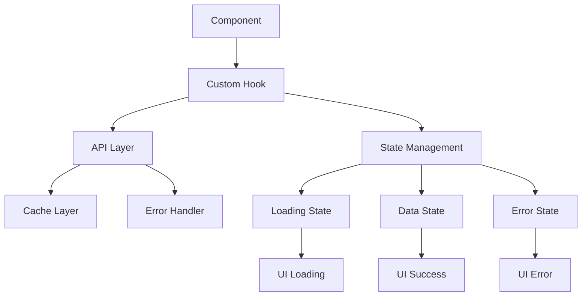

# Advanced Data Fetching Patterns

## Custom Hooks for Data Fetching

Create reusable hooks to manage data fetching logic:

```jsx
function useDataFetching(url) {
  const [data, setData] = useState(null);
  const [loading, setLoading] = useState(false);
  const [error, setError] = useState(null);

  const fetchData = useCallback(async () => {
    setLoading(true);
    setError(null);
    try {
      const response = await fetch(url);
      if (!response.ok) throw new Error('Network response was not ok');
      const result = await response.json();
      setData(result);
    } catch (err) {
      setError(err.message);
    } finally {
      setLoading(false);
    }
  }, [url]);

  useEffect(() => {
    fetchData();
  }, [fetchData]);

  return { data, loading, error, refetch: fetchData };
}
```

## Error Boundaries

Implement error boundaries to catch and handle errors gracefully:

```jsx
class ErrorBoundary extends React.Component {
  constructor(props) {
    super(props);
    this.state = { hasError: false };
  }

  static getDerivedStateFromError(error) {
    return { hasError: true };
  }

  componentDidCatch(error, errorInfo) {
    console.log('Error caught by boundary:', error, errorInfo);
  }

  render() {
    if (this.state.hasError) {
      return <h1>Something went wrong.</h1>;
    }

    return this.props.children;
  }
}
```

## Optimistic Updates

Update UI immediately while making API calls:

```jsx
function useOptimisticUpdate() {
  const [data, setData] = useState(null);

  const updateOptimistically = useCallback(
    async (newData, updateFn) => {
      // Update UI immediately
      setData(newData);

      try {
        // Make API call
        await updateFn();
      } catch (error) {
        // Revert on error
        setData(data);
        throw error;
      }
    },
    [data]
  );

  return { data, updateOptimistically };
}
```

## Data Fetching Architecture



## Best Practices

1. **Always handle loading states** - Users need feedback
2. **Implement error boundaries** - Graceful error handling
3. **Use AbortController** - Cancel requests when component unmounts
4. **Implement retry logic** - Network failures are common
5. **Cache responses** - Avoid unnecessary API calls
6. **Debounce search inputs** - Reduce API calls during typing

```jsx
// Example with AbortController
useEffect(() => {
  const abortController = new AbortController();

  const fetchData = async () => {
    try {
      const response = await fetch(url, {
        signal: abortController.signal,
      });
      const data = await response.json();
      setData(data);
    } catch (error) {
      if (error.name === 'AbortError') {
        // Request was cancelled
        return;
      }
      setError(error.message);
    }
  };

  fetchData();

  return () => {
    abortController.abort();
  };
}, [url]);
```

## React Query / TanStack Query

For more advanced data fetching, consider using React Query:

```jsx
import { useQuery, useMutation, useQueryClient } from '@tanstack/react-query';

function PostsComponent() {
  const {
    data: posts,
    isLoading,
    error,
  } = useQuery({
    queryKey: ['posts'],
    queryFn: fetchPosts,
    staleTime: 5 * 60 * 1000, // 5 minutes
  });

  const queryClient = useQueryClient();

  const mutation = useMutation({
    mutationFn: createPost,
    onSuccess: () => {
      // Invalidate and refetch
      queryClient.invalidateQueries({ queryKey: ['posts'] });
    },
  });

  if (isLoading) return <div>Loading...</div>;
  if (error) return <div>Error: {error.message}</div>;

  return (
    <div>
      {posts.map((post) => (
        <div key={post.id}>{post.title}</div>
      ))}
    </div>
  );
}
```

## Suspense and Error Boundaries

React 18+ supports Suspense for data fetching:

```jsx
function App() {
  return (
    <ErrorBoundary fallback={<ErrorFallback />}>
      <Suspense fallback={<LoadingSpinner />}>
        <PostsList />
      </Suspense>
    </ErrorBoundary>
  );
}

function PostsList() {
  const posts = use(fetchPosts()); // use() hook for promises

  return (
    <div>
      {posts.map((post) => (
        <Post key={post.id} post={post} />
      ))}
    </div>
  );
}
```

## Performance Considerations

- **Debouncing**: Limit API calls during rapid user input
- **Caching**: Store responses to avoid duplicate requests
- **Pagination**: Load data in chunks for large datasets
- **Virtualization**: Render only visible items for long lists
- **Background updates**: Refresh data without blocking UI
