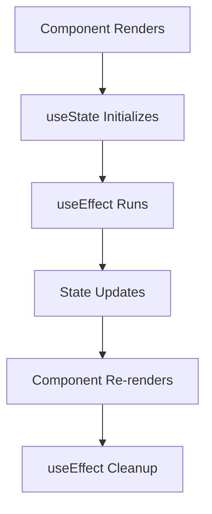

# React Hooks

Hooks are functions that let you "hook into" React state and lifecycle features from function components.

## Basic Hooks

### useState

Manages local state in functional components.

```jsx
function Counter() {
  const [count, setCount] = useState(0);
  return <button onClick={() => setCount(count + 1)}>Count: {count}</button>;
}
```

### useEffect

Handles side effects in functional components.

```jsx
function DataFetcher() {
  const [data, setData] = useState(null);

  useEffect(() => {
    fetch('/api/data')
      .then((res) => res.json())
      .then(setData);
  }, []); // Empty dependency array = run once
}
```

## Hooks Flow



## Rules of Hooks

1. **Only call hooks at the top level**
2. **Only call hooks from React functions**
3. **Hook names must start with "use"**

## Custom Hooks

```jsx
function useLocalStorage(key, initialValue) {
  const [storedValue, setStoredValue] = useState(() => {
    try {
      const item = window.localStorage.getItem(key);
      return item ? JSON.parse(item) : initialValue;
    } catch (error) {
      return initialValue;
    }
  });

  const setValue = (value) => {
    try {
      setStoredValue(value);
      window.localStorage.setItem(key, JSON.stringify(value));
    } catch (error) {
      console.log(error);
    }
  };

  return [storedValue, setValue];
}
```

## Hook Dependencies

Understanding when hooks re-run is crucial:

```jsx
// Runs after every render
useEffect(() => {
  console.log('Effect runs every time');
});

// Runs only once after initial render
useEffect(() => {
  console.log('Effect runs once');
}, []);

// Runs when count changes
useEffect(() => {
  console.log('Effect runs when count changes');
}, [count]);

// Runs when count or name changes
useEffect(() => {
  console.log('Effect runs when count or name changes');
}, [count, name]);
```

## Common Hook Patterns

### Form Handling

```jsx
function useForm(initialValues) {
  const [values, setValues] = useState(initialValues);

  const handleChange = (e) => {
    const { name, value } = e.target;
    setValues((prev) => ({
      ...prev,
      [name]: value,
    }));
  };

  const reset = () => setValues(initialValues);

  return { values, handleChange, reset };
}
```

### API Calls

```jsx
function useApi(url) {
  const [data, setData] = useState(null);
  const [loading, setLoading] = useState(false);
  const [error, setError] = useState(null);

  const fetchData = useCallback(async () => {
    setLoading(true);
    try {
      const response = await fetch(url);
      const result = await response.json();
      setData(result);
    } catch (err) {
      setError(err.message);
    } finally {
      setLoading(false);
    }
  }, [url]);

  useEffect(() => {
    fetchData();
  }, [fetchData]);

  return { data, loading, error, refetch: fetchData };
}
```
