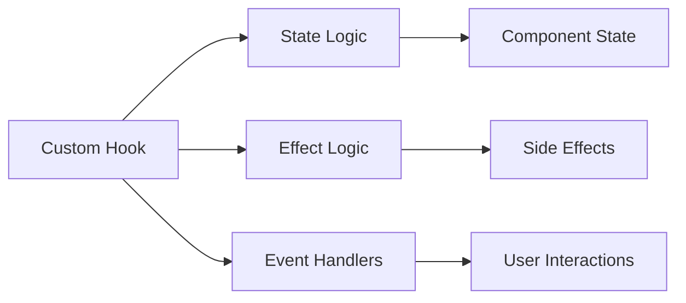

# Custom Hooks

## Building Reusable Logic

Custom hooks let you extract component logic into reusable functions.

```jsx
function useDataFetching(url) {
  const [data, setData] = useState(null);
  const [loading, setLoading] = useState(false);
  const [error, setError] = useState(null);

  const fetchData = useCallback(async () => {
    setLoading(true);
    setError(null);
    try {
      const response = await fetch(url);
      if (!response.ok) throw new Error('Network response was not ok');
      const result = await response.json();
      setData(result);
    } catch (err) {
      setError(err.message);
    } finally {
      setLoading(false);
    }
  }, [url]);

  useEffect(() => {
    fetchData();
  }, [fetchData]);

  return { data, loading, error, refetch: fetchData };
}
```

## Advanced Hook Patterns

### useReducer for Complex State

```jsx
function useCounter(initialState = 0) {
  const [state, dispatch] = useReducer(counterReducer, initialState);

  const increment = () => dispatch({ type: 'INCREMENT' });
  const decrement = () => dispatch({ type: 'DECREMENT' });
  const reset = () => dispatch({ type: 'RESET' });

  return { count: state, increment, decrement, reset };
}

function counterReducer(state, action) {
  switch (action.type) {
    case 'INCREMENT':
      return state + 1;
    case 'DECREMENT':
      return state - 1;
    case 'RESET':
      return 0;
    default:
      return state;
  }
}
```

### useCallback and useMemo

```jsx
function ExpensiveComponent({ items, onItemClick }) {
  // Memoize expensive calculation
  const expensiveValue = useMemo(() => {
    return items.reduce((acc, item) => acc + item.value, 0);
  }, [items]);

  // Memoize callback to prevent unnecessary re-renders
  const handleClick = useCallback(
    (item) => {
      onItemClick(item);
    },
    [onItemClick]
  );

  return (
    <div>
      <p>Total: {expensiveValue}</p>
      {items.map((item) => (
        <button key={item.id} onClick={() => handleClick(item)}>
          {item.name}
        </button>
      ))}
    </div>
  );
}
```

## Hook Composition



## Advanced Hooks

### useRef for DOM Access

```jsx
function useFocus() {
  const inputRef = useRef(null);

  const focus = useCallback(() => {
    inputRef.current?.focus();
  }, []);

  return { inputRef, focus };
}

function InputWithFocus() {
  const { inputRef, focus } = useFocus();

  return (
    <div>
      <input ref={inputRef} placeholder="Type here..." />
      <button onClick={focus}>Focus Input</button>
    </div>
  );
}
```

### useImperativeHandle for Parent-Child Communication

```jsx
const FancyInput = forwardRef((props, ref) => {
  const inputRef = useRef();

  useImperativeHandle(ref, () => ({
    focus: () => inputRef.current.focus(),
    blur: () => inputRef.current.blur(),
    select: () => inputRef.current.select(),
  }));

  return <input ref={inputRef} {...props} />;
});

function Parent() {
  const inputRef = useRef();

  const handleFocus = () => {
    inputRef.current.focus();
  };

  return (
    <div>
      <FancyInput ref={inputRef} />
      <button onClick={handleFocus}>Focus</button>
    </div>
  );
}
```

### useLayoutEffect for Synchronous Updates

```jsx
function useWindowSize() {
  const [size, setSize] = useState({
    width: window.innerWidth,
    height: window.innerHeight,
  });

  useLayoutEffect(() => {
    const handleResize = () => {
      setSize({
        width: window.innerWidth,
        height: window.innerHeight,
      });
    };

    window.addEventListener('resize', handleResize);
    return () => window.removeEventListener('resize', handleResize);
  }, []);

  return size;
}
```

## Testing Custom Hooks

```jsx
import { renderHook, act } from '@testing-library/react';

test('useCounter increments count', () => {
  const { result } = renderHook(() => useCounter(0));

  act(() => {
    result.current.increment();
  });

  expect(result.current.count).toBe(1);
});

test('useCounter respects initial value', () => {
  const { result } = renderHook(() => useCounter(5));

  expect(result.current.count).toBe(5);
});
```

## Hook Best Practices

### 1. Keep Hooks Focused

```jsx
// ❌ Bad: Too many responsibilities
function useUser() {
  const [user, setUser] = useState(null);
  const [posts, setPosts] = useState([]);
  const [settings, setSettings] = useState({});
  // ... many more states
}

// ✅ Good: Single responsibility
function useUser() {
  const [user, setUser] = useState(null);
  // ... only user-related logic
}

function useUserPosts() {
  const [posts, setPosts] = useState([]);
  // ... only posts-related logic
}
```

### 2. Use Descriptive Names

```jsx
// ❌ Bad: Unclear purpose
function useData() { ... }

// ✅ Good: Clear purpose
function useUserProfile() { ... }
function usePostComments() { ... }
```

### 3. Handle Cleanup Properly

```jsx
function useInterval(callback, delay) {
  useEffect(() => {
    const id = setInterval(callback, delay);

    // Always return cleanup function
    return () => clearInterval(id);
  }, [callback, delay]);
}
```

### 4. Optimize with useCallback/useMemo

```jsx
function useExpensiveCalculation(data) {
  return useMemo(() => {
    return data.reduce((acc, item) => {
      // Expensive calculation here
      return acc + complexCalculation(item);
    }, 0);
  }, [data]);
}
```

## Hook Libraries

### React Hook Form

```jsx
import { useForm } from 'react-hook-form';

function Form() {
  const {
    register,
    handleSubmit,
    formState: { errors },
  } = useForm();

  const onSubmit = (data) => console.log(data);

  return (
    <form onSubmit={handleSubmit(onSubmit)}>
      <input {...register('firstName', { required: true })} />
      {errors.firstName && <span>This field is required</span>}
      <button type="submit">Submit</button>
    </form>
  );
}
```

### React Query

```jsx
import { useQuery } from '@tanstack/react-query';

function Posts() {
  const { data, isLoading, error } = useQuery({
    queryKey: ['posts'],
    queryFn: fetchPosts,
  });

  if (isLoading) return <div>Loading...</div>;
  if (error) return <div>Error: {error.message}</div>;

  return (
    <div>
      {data.map((post) => (
        <Post key={post.id} post={post} />
      ))}
    </div>
  );
}
```

## Performance Considerations

- **Dependency Arrays**: Always include all reactive values
- **Object/Array Dependencies**: Use useMemo to prevent unnecessary re-renders
- **Function Dependencies**: Use useCallback for stable references
- **Cleanup Functions**: Prevent memory leaks and stale closures
- **Hook Order**: Never call hooks conditionally or in loops
